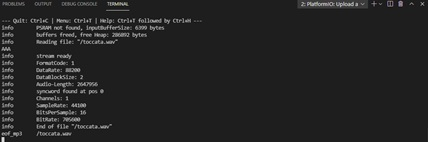

Pol Naharro
## PRACTICA 7 : Buses de comunicación III(I2S)

##### Código Ejercicio Practico 2 reproducir un archivo WAVE en ESP32 desde una tarjeta SD externa
```
#include <Arduino.h>
#include "Audio.h"
#include "SD.h"
#include "FS.h"

// Digital I/O used
#define SD_CS 4
#define SPI_MOSI 23
#define SPI_MISO 19
#define SPI_SCK 18
#define I2S_DOUT 25
#define I2S_BCLK 27
#define I2S_LRC 26

Audio audio;

void setup(){
    pinMode(23,INPUT_PULLUP);
    pinMode(SD_CS, OUTPUT);
    digitalWrite(SD_CS, HIGH);
    SPI.begin(SPI_SCK, SPI_MISO, SPI_MOSI);
    Serial.begin(9600);

    SD.begin(SD_CS);

    audio.setPinout(I2S_BCLK, I2S_LRC, I2S_DOUT);
    audio.setVolume(10); // 0...21
    audio.connecttoFS(SD, "/toccata.wav");
    Serial.println("AAA");
}

void loop(){
    audio.loop();
}

// optional
void audio_info(const char *info){
    Serial.print("info        "); Serial.println(info);
}
void audio_id3data(const char *info){  //id3 metadata
    Serial.print("id3data     ");Serial.println(info);
}
void audio_eof_mp3(const char *info){  //end of file
    Serial.print("eof_mp3     ");Serial.println(info);
}
void audio_showstation(const char *info){
    Serial.print("station     ");Serial.println(info);
}
void audio_showstreaminfo(const char *info){
    Serial.print("streaminfo  ");Serial.println(info);
}
void audio_showstreamtitle(const char *info){
    Serial.print("streamtitle ");Serial.println(info);
}
void audio_bitrate(const char *info){
    Serial.print("bitrate     ");Serial.println(info);
}
void audio_commercial(const char *info){  //duration in sec
    Serial.print("commercial  ");Serial.println(info);
}
void audio_icyurl(const char *info){  //homepage
    Serial.print("icyurl      ");Serial.println(info);
}
void audio_lasthost(const char *info){  //stream URL played
    Serial.print("lasthost    ");Serial.println(info);
}
void audio_eof_speech(const char *info){
    Serial.print("eof_speech  ");Serial.println(info);
}
```
##### Explicación:

El objetivo es reproducir un audio que se encuentra en una SD, para ello primero asignamos el audio como Audio.
```
Audio audio;
```
Ahora definimos los pins e inicializamos el Serial, la SD Y LA SDI.
```
pinMode(23,INPUT_PULLUP);
pinMode(SD_CS, OUTPUT);
digitalWrite(SD_CS, HIGH);
SPI.begin(SPI_SCK, SPI_MISO, SPI_MOSI);
Serial.begin(9600);
SD.begin(SD_CS);
```
A continuación, en la variable audio, le asignamos los pins, definimos el volumen el cual queremos escuchar y guardamos el sonido elegido de la SD a la variable, siguiendo las siguientes instrucciones:
```
audio.setPinout(I2S_BCLK, I2S_LRC, I2S_DOUT);
audio.setVolume(10); // 0...21
audio.connecttoFS(SD, "/toccata.wav");
```
En el loop reproducieremos el audio que está en la SD y se ha conectado en el apartado anterior.

Los siguientes voids nos aportan información de la canción, pero estos son un añadido opcional.

##### Funcionamiento de la práctica:

Comprobación:

